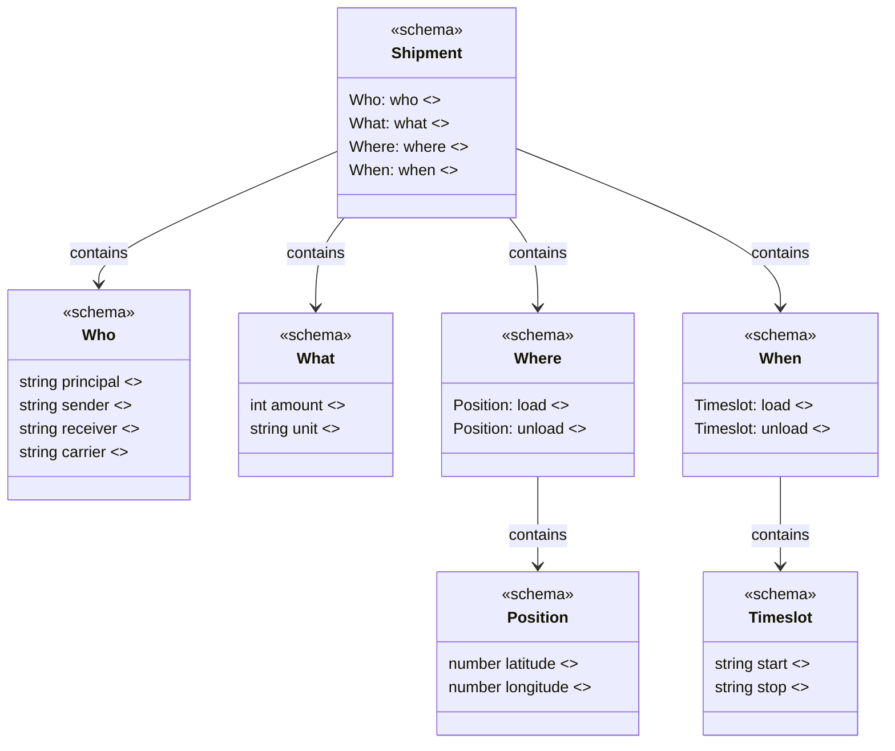

# The open standard of simple logistics data

Carqo is an open-source standard that makes logistics data simple. By focusing only on the essential questions of who is involved, what is shipped, where it is loaded and unloaded, and when, it removes unnecessary complexity and allows organizations to exchange information clearly, consistently, and efficiently.

## As simple as possible

This object provides a minimal yet complete representation of a shipment by addressing the four key questions: **who** is involved, **what** is being shipped, **where** it is loaded and unloaded, and **when** the operations are scheduled.

```json
{
  "what": {
    "amount": 33,
    "unit": "PALLET"
  },
  "where": {
    "load": {
      "latitude": 52.400334,
      "longitude": 6.61591
    },
    "unload": {
      "latitude": 51.893867,
      "longitude": 4.520616
    }
  },
  "when": {
    "load": {
      "start": "2026-05-28T08:00:00Z",
      "stop": "2026-05-28T09:00:00Z"
    },
    "unload": {
      "start": "2026-05-28T16:00:00Z",
      "stop": "2026-05-28T17:00:00Z"
    }
  }
}
```

## Structure

This class diagram represents the fundamental structure of Carqo shipments, highlighting the four key questions: **who**, **what**, **where** and **when**, keeping logistics data simple and clear.


