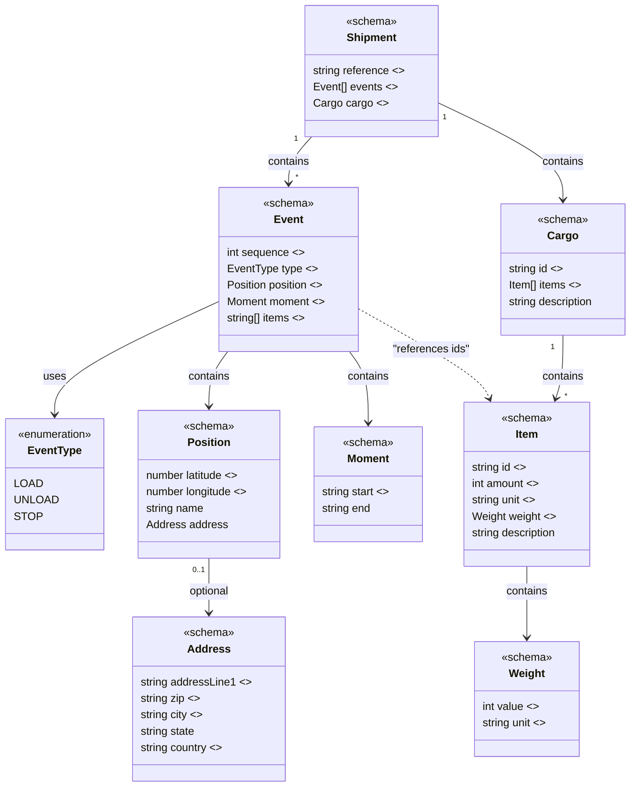

# 📦 Carqo

Carqo is an open-source logistics data standard that brings clarity and simplicity to the global transport ecosystem. It defines a unified structure for shipments, parties, planning, and reporting, allowing carriers, shippers, platforms, and software vendors to speak the same language.

## Structure

