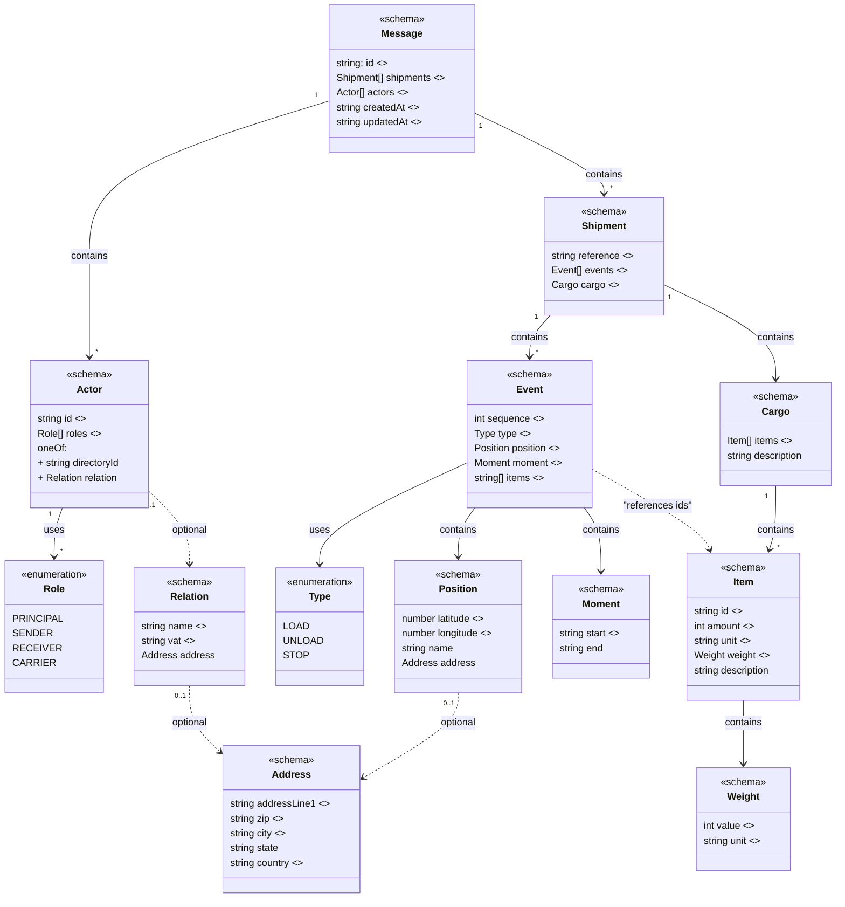

# The open standard for simple, structured logistics data

Carqo is an open-source data standard for logistics that brings transparency and simplicity to the global transport ecosystem. The standard provides a uniform and accessible structure for shipments and all involved parties, enabling organizations to exchange information consistently and collaborate far more efficiently.

## Model



## Example

As simple as possible:

```json
{
  "id": "467491f1-d1b1-4fe8-b9d4-cda8623c8403",
  "shipments": [
    {
      "reference": "SHIPMENT-001",
      "events": [
        {
          "sequence": 1,
          "type": "LOAD",
          "position": {
            "latitude": 52.400334,
            "longitude": 6.61591
          },
          "moment": {
            "start": "2026-05-28T07:00:00Z"
          },
          "items": ["ITEM-001"]
        },
        {
          "sequence": 2,
          "type": "UNLOAD",
          "position": {
            "latitude": 51.893867,
            "longitude": 4.520616
          },
          "moment": {
            "start": "2026-05-28T17:00:00Z"
          },
          "items": ["ITEM-001"]
        }
      ],
      "cargo": {
        "items": [
          {
            "id": "ITEM-001",
            "amount": 5,
            "unit": "BOX",
            "weight": {
              "value": 250,
              "unit": "KG"
            }
          }
        ]
      }
    }
  ],
  "actors": [
    {
      "id": "ACTOR-001",
      "roles": ["PRINCIPAL", "SENDER"],
      "directoryId": "org:carqo:1234567890"
    },
    {
      "id": "ACTOR-002",
      "roles": ["RECEIVER"],
      "directoryId": "org:carqo:2468101214"
    },
    {
      "id": "ACTOR-003",
      "roles": ["CARRIER"],
      "directoryId": "org:carqo:0987654321"
    }
  ],
  "createdAt": "2026-05-28T07:00:00Z",
  "updatedAt": "2026-05-28T17:00:00Z"
}
```
