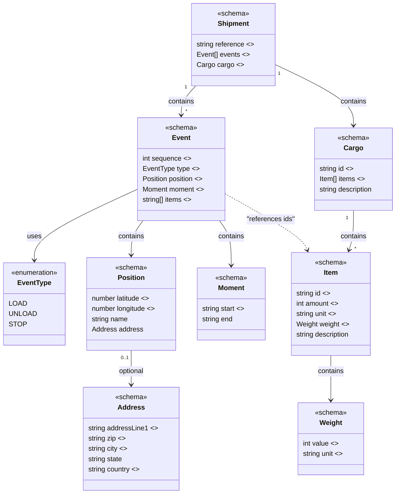

# 📦 Carqo

Carqo is an open-source logistics data standard that brings clarity and simplicity to the global transport ecosystem. It defines a unified structure for shipments, parties, planning, and reporting, allowing carriers, shippers, platforms, and software vendors to speak the same language.

## Model



## Example

As simple as possible:

```json
{
  "reference": "SHIPMENT-001",
  "events": [
    {
      "sequence": 1,
      "type": "LOAD",
      "position": {
        "latitude": 52.400334,
        "longitude": 6.61591
      },
      "moment": {
        "start": "2026-05-28T07:00:00Z"
      },
      "items": ["CARGO-001-ITEM-001"]
    },
    {
      "sequence": 2,
      "type": "UNLOAD",
      "position": {
        "latitude": 51.893867,
        "longitude": 4.520616
      },
      "moment": {
        "start": "2026-05-28T17:00:00Z"
      },
      "items": ["CARGO-001-ITEM-001"]
    }
  ],
  "cargo": {
    "id": "CARGO-001",
    "items": [
      {
        "id": "CARGO-001-ITEM-001",
        "amount": 5,
        "unit": "BOX",
        "weight": {
          "value": 250,
          "unit": "KG"
        }
      }
    ]
  }
}
```
